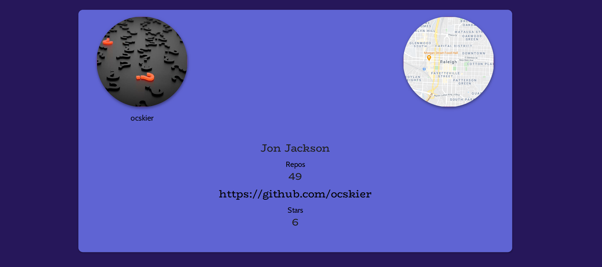

# Git Pro Generator
  
  

<br>

A Node JS application that asks the user questions and generates a GH profile PDF

<br>



## Prerequisites

<a href="https://nodejs.org/en/"></a>

## Installation

Use Node JS command line to install packages

```bash
npm i
```

## Usage

```bash
npm run start
```

## Running Tests

```bash
npm run tsc
```

## Deployment

N/A

## Authors


[Jon Jackson](http://github.com/ocskier)

## Contributing
Please make sure to update tests as appropriate.

## License

[MIT](LICENSE)

